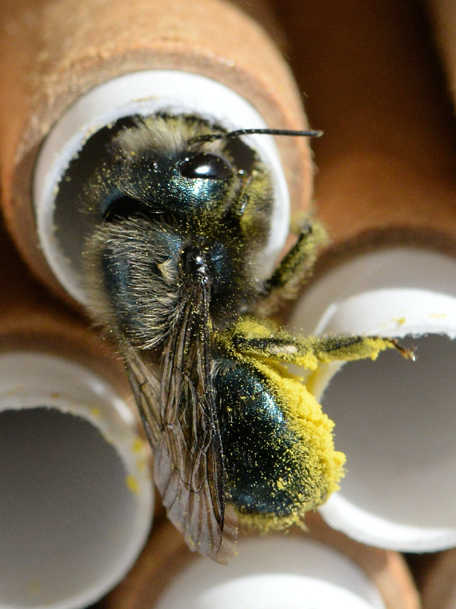

```{r, echo = FALSE}
knitr::opts_chunk$set(echo = FALSE, message = FALSE, warning = FALSE, error = FALSE)
options(tinytex.verbose = TRUE)
```

# 1. Introduction

## 1.1 Background

Like many species around the world, pollinators are heavily affected by habitat loss, often driven by agricultural intensification, among other factors like pesticide use, disease and climate change [@potts2010]. Natural habitats provide floral and nesting resources to pollinators which are both essential to survival and growth [@roulston2011]. Ironically, while, most pollinator population declines are often attributed to agriculture, pollinators have been shown to not only enhance crop production but also, to be uniquely essential to the production of certain crops like macadamia, cantaloupe and watermelon [@klein2006]. Several studies have used artificial nesting structures, also known as trap nests or bee hotels [@geslin2020], to not only study wild bees but also, to promote their conservation in urban and agricultural settings [@macivor2015; @boyle2017]. Understanding how bees respond to their environment, and in particular, to changes in resource availability like with floral and nesting resources, can allow us to better predict their abundance and by extension their survival. Most importantly, this can aid in developping better conservation strategies in both natural and agricultural environments.



## 1.2 Study System

While nesting structures are widely used in the study of bees, no study has yet examined whether the provision of nesting structures actually increases local bee populations in comparison to control populations, establishing that bees are nest site limited [@westerfelt2018; @roulston2011]. In order to conduct such a study, I must first test that nesting structures installed in anthropogenic habitat are not a population sink, attracting nesting female bees to a potentially unfit environment for larval survival, which could theoretically harm, rather than protect, local wild bee populations.

In Hungarian apple orchards, it has been found that when comparing nesting structures installed in paired apple orchard and natural habitat sites, higher colonization rates and counts of bee and wasp live offspring were observed in semi-natural habitat [@bihaly2020]. This is possibly due to a higher prevalence of floral resources in semi-natural habitat when compared to orchard floral resources [@bihaly2020].

In fruit orchards, a wide variety of pollinators such as butterflies, wasps and of course, bees, both domestic and wild, can be found. *Osmia* spp. is a common wild bee genus in fruit orchards that distinguishes itself from other bees, like honey bees, by its ability to fly at cooler temperatures [@isaacs2017; @boyle2019] and deposit higher pollen loads on a wide-range of flowers [@földesi2015]. To test whether similar observations can be made in orchards within the greater Ottawa area, nesting structure survival rates of *Osmia* spp. ("mason bees") offspring in orchard and natural habitats will be compared with one another.

## 1.3 Hypothesis

The installation of nesting structures in apple orchards, are potential population sinks rather than populations sources, conceivably due to lesser floral resource availability over the entire growing season. As a result, nesting structures in natural habitat will have a greater ratio of survival of *Osmia spp.* offspring when compared to apple orchard habitat.

## 1.4 Prediction

If nesting structures placed in natural environments have a significantly greater *Osmia spp.* survival ratio than orchard environments, then it is likely that nesting structures placed in orchard environments are an *Osmia spp.* population sink.

# 2. Methods

## 2.1 Data Collection

This study was conducted from May to August 2017 in 7 apple orchards and 8 natural habitats (6 on National Capital Commission (NCC) grounds and 2 on City of Ottawa grounds) around the Ottawa-area for a total of 15 sites. Overall, 75 nesting blocks were installed in both natural and orchard habitats with 5 blocks per site. Each block had 10 nests or holes.

Throughout these 4 months, various insects, mostly wasps and bees, inhabited the holes, and some nested within them, laying their eggs. The eggs developed first as larvae, then as pupae. In September, the blocks were collected and stored in a laboratory environment where the insects over-wintered (hibernated). Before their expected scheduled emergence, the nests were inspected and *Osmia* spp. cell survival count was estimated using visual markers such as nest material and cell size.

## 2.2 Data Set

```{r 2.1 Data Set Packages}

library(readxl)
```

```{r 2.2 Data Set Osmia Survival}

Osmia <- read_excel("Osmia Survival.xlsx")
Osmia <- as.data.frame(Osmia)

Osmia <- within(Osmia, surv.ratio <- No.surv.osmia / No.cells)
Osmia <- within(Osmia, No.death <- No.cells-No.surv.osmia)
Osmia <- within(Osmia, death.ratio <- No.death/No.cells)

Osmia$Hole_ID <- paste0(Osmia$s.ID, Osmia$Hole)
Osmia$Block_ID <- paste0(Osmia$s.ID, Osmia$Block)

Osmia <- as.data.frame(Osmia)
```

The "Osmia Survival.xlsx" file contains the data that will be used for subsequent statistical analyses. It includes information such as the original number of cells observed in the straw (*No.cells*), the initial perceived number of surviving cells (*No.surv.cells*) as well as a validated revised number of surviving *Osmia* spp. cells (*No.surv.osmia*). The number of *Osmia* spp. cell deaths was calculated as the difference between the number of cells and the revised number of surviving *Osmia* spp. cells (*No.death*).

It is important to note that the number of surviving cells does not account for bees that died over winter due to unfavorable storage conditions. Therefore, we are only accounting for deaths of bees that have clearly died as larvae either through parasitization or other un-diagnosed causes. Deaths at the larval stage can only be attributed to causes occurring during the growing season or associated with either orchard or natural conditions. By the developmental stage of adult eclosion, nests were already transferred to a laboratory environment. Any deaths occurring at the adult stage are ignored.

## 2.2 Statistical Methods

```{r 2.2 Statistical Methods Packages}

library(car)
```

To explore frequentist and bayesian statistics, as an exercise, I will be running the same model using these two different approaches. Due to differences in code structure, the response for the frequentist approach will be written as ratio (*No.surv.osmia/No.cells*) while the bayesian approach will be written as a combined column (*cbind(No.surv.osmia, No.death)*). The random effects of each approach will be the same (block ID nested within site ID).

Because the response that is measured is the proportion of surviving Osmia offspring, the data is not normally distributed but binomially distributed. This was verified using both a histogram (***Figure 2a***) of the distribution of the frequency of *Osmia* spp. survival ratios and a q-q plot (***Figure 2b***). Thus, all models will be run using a binomial distribution.

```{r 2.2 Statistical Methods Normality, results = FALSE, fig.cap="\\label{fig:figs}Normality Tests of *Osmia* spp. survival ratio a) Histogram and b) Q-Q Plot"}

layout(mat = matrix(c(2, 1), 
                        nrow = 1, 
                        ncol = 2),
       heights = c(2,2),
       widths = c(2, 2))
qqPlot(Osmia$surv.ratio, main ="b)", xlab="Normal Quantiles", ylab="Osmia spp. Survival Ratio")
hist(Osmia$surv.ratio, xlab="Osmia Survival Ratio", main="a)")
```

### 2.2.1 Frequentist Approach

```{r 2.2.1 Frequentist Approach Packages}

library(lme4)
library(tidyverse)
library(purrr)
library(ggplot2)
library(car)
library(MASS)
library(RVAideMemoire)
library(GLMMadaptive)
```

Knowing that the data was hierarchical with random effects of block nested within site, I wanted to test the significance of these terms. To do this, I ran a simple generalized linear model (GLM).

```{r 2.2.1.1 Frequentist Approach GLME}

osmiaglm <- glm(No.surv.osmia/No.cells ~ s.type, weights = No.cells, 
                family = binomial(link="logit"), data=Osmia)
summary(osmiaglm)
```

Out of curiosity, I also wanted to test the results that I would get if I ignored the hierarchical structure of the data and simply fit site as a random effect in a generalized linear mixed model (GLMM).

```{r Frequentist Approach GLMM Nest}

osmiaglmmtest <- glmer(No.surv.osmia/No.cells ~ s.type + (1|s.ID), 
                       family = binomial(link="logit"), data = Osmia)
summary(osmiaglmmtest)
```

Afterwards, I accounted for the hierarchical structure of the data and ran a more adequate GLMM using block nested within site as a random effect.

```{r Frequentist Approach GLMM}

osmiaglmm <- glmer(No.surv.osmia/No.cells ~ s.type + (1|s.ID/Block_ID), 
                   weights = No.cells, family = binomial(link="logit"), 
                   data=Osmia)
summary(osmiaglmm)
```

#### 2.2.1.1 Frequentist Key Assumptions

The main assumption of a GLMM, is that the chosen probability distribution and associated link function is appropriate for the data. As previously stated, due to the use of proportional data, the distribution used was binomial and the link function was the logarithm of the odds (logit). Another assumption is that the random effects are normally distributed. Finally, it is assumed that there is no over-dispersion or under-dispersion. This refers to the constancy of the variance and was verified by comparing the ratio of the residual deviance to the degrees of freedom using the *overdisp.glmm* function. A final implicit assumptions of GLMMs, as with all model types, is to match the model with the data and its structure and to properly identify the fixed versus the random effects.

To evaluate model fit, a likelihood ratio test using the *drop1* function was conducted. The GLMM and GLM versions of the model output (one with the random effect term of block nested within site and one without) were compared via a likelihood ratio test and also by simply comparing their Aikake Information Criteria (AIC) from their model outputs. The normality of the random effects was assessed visually using a q-q plot (***Figure 5***). While this is not an explicit assumption of GLMM, the normality of the residuals were evaluated visually using a residuals versus fitted values plot (***Figure 4***).

### 2.2.2 Bayesian Approach

```{r 2.2.2 Bayesian Approach Packages}

library(tidyverse)
library(MCMCglmm)
library(bayesplot)
```

Two Monte Carlo Markov Chains (MCMC) were run following the same model structure described previously (random effects of block nested within site and the binomial probability distribution). The first chain consisted of a test run and was sequenced using the default settings of the *MCMCglmm* package (sample size of 1,000, number of iterations of 13,000, burnin of 3,000, thin of 10). The second chain (with R model output below) was run with a larger sample size and number of iterations as well as adjusted priors (sample size of 4,000, number of iterations of 2,020,000, burnin of 20,000, thin of 500, V=1, nu=1).

```{r 2.2.2 Bayesian Approach Initial Chain, include = FALSE, message = FALSE, warning = FALSE}

osmiabayes <- MCMCglmm(cbind(No.surv.osmia, No.death) ~ s.type,
    random = ~s.ID + Block_ID:s.ID,
    family = "multinomial2", 
    data = Osmia)
summary(osmiabayes)
```

```{r 2.2.2 Bayesian Approach Final Chain, echo = FALSE, message = FALSE, warning = FALSE}

n_samp <- 4000
thin <- 500
burnin <- 20000
osmiabayesfinal <- MCMCglmm(cbind(No.surv.osmia, No.death) ~ s.type,
    random = ~s.ID + Block_ID:s.ID,
    family = "multinomial2",
    data = as.data.frame(Osmia),
    nitt = n_samp * thin + burnin, thin = thin, burnin = burnin,
    verbose = FALSE,
    prior = list(
      R = list(V = 1, nu = 1),
      G = list(
        G1 = list(V = 1, nu = 1, alpha.mu=0, alpha.V=100),
        G2 = list(V = 1, nu = 1, alpha.mu=0, alpha.V=100)
      )
    )
  )
summary(osmiabayesfinal)
```

#### 2.2.2.1 Bayesian Key Assumptions

Posterior trace and density plots were used to visually diagnose the variance and autocorrelation of each iterative value in the chains. The *autocorr.diag* functions were used to assess the autocorrelation of the chain in further detail. The *raftery.diag* function was used to diagnostically determine the optimal sample size for the final chain (sample size of 4,000).

# 3. Results

## 3.1 General Results

```{r 3.1 General Results Packages}

library(data.table)
library(dplyr)
library(tidyr)
library(readxl)
library(ggplot2)
```

```{r 3.1 General Results Data Set}

TNS <- read_excel("Total Nesting Structures.xlsx")

TNS_1 <- TNS %>% group_by(Site_type=TNS$Site_type, Site_ID=TNS$Site_ID) %>% summarise(number_of_nests=length(unique(Block))) 
```

At the end of August 2017, `r sum(as.numeric(TNS_1$number_of_nests))` out of the initial 75 installed nests were occupied, with `r sum(subset(TNS_1, TNS_1$Site_type == "n")$number_of_nests)` occupied blocks in natural habitats and `r sum(subset(TNS_1, TNS_1$Site_type == "o")$number_of_nests)` occupied blocks in orchard habitats by various species of bees and wasps.

## 3.2 Statistical Results

### 3.2.1 Frequentist Results

```{r 3.2.1 Frequentist Results Packages}

library(jtools)
library(lmtest)
library(sjPlot)
library(gridExtra)
```

Following the GLMM, in ***Figure 2***, we see that orchard sites do not have a significant effect on *Osmia* spp. survival (p = 0.883) and that as a result, there is no detectable difference among survival ratios in orchard sites when compared to natural sites. This applies not only to the GLMM ouput in ***Figure 2a*** but also the means of the raw data in ***Figure 2b***.

```{r 3.2.1.1 Frequentist Results GLMM Figure Preparation, include = FALSE}

osmiaglmmg <- fortify.merMod(model = osmiaglmm)
osmiaglmmg
```

```{r 3.2.1.1 Frequentist Results GLMM Figure, fig.cap="\\label{fig:figs}*Osmia* spp. survival versus habitat type with a) GLMM estimates using odds ratio and b) untransformed means ± standard deviation (raw data)"}

Osmia.glmmplot <- ggplot(data=osmiaglmmg, mapping=aes(x=s.type, y=.fitted)) +
  geom_point(colour = 'lightblue') +
  geom_point(data=osmiaglmmg, aes(y=mean(.fitted)), colour = 'darkblue', size=3) +
  labs(y="Osmia Survival Ratio (Odd Ratios)", x="a)") + 
  geom_errorbar(data=osmiaglmmg, mapping=aes(x=s.type, ymin = mean(.fitted)+sd(.fitted), ymax = mean(.fitted)-sd(.fitted)), colour = 'darkblue', width = 0.1) 

Osmia.glmmplot <- Osmia.glmmplot + scale_x_discrete(labels=c("n"="Natural Sites", "o"= "Orchard Sites"))


Osmia.surv.plot <- 
  ggplot(data=Osmia, mapping=aes(x=s.type, y=surv.ratio)) +
  geom_point(colour = 'lightgreen') +
  geom_point(data=Osmia, aes(y=mean(surv.ratio)), colour = 'darkgreen', size=3) +
  labs(y="Osmia Survival Ratio", x="b)") + 
  geom_errorbar(data=Osmia, mapping=aes(x=s.type, ymin = mean(surv.ratio)+sd(surv.ratio), ymax = mean(surv.ratio)-sd(surv.ratio)), colour = 'darkgreen', width =0.1)

Osmia.surv.plot <- Osmia.surv.plot + scale_x_discrete(labels=c("n"="Natural Sites", "o"= "Orchard Sites"))

Osmia.glmmpanel <- grid.arrange(Osmia.glmmplot, Osmia.surv.plot, nrow = 1)
```

The GLMM output shows that when controlling for differences in site and block characteristics, there is no evidence that there is a difference in *Osmia* spp. larvae survival among orchard and natural habitat types.

```{r 3.2.1 Frequentist Results Tables, fig.cap="\\label{fig:figs}Summary of final GLMM output including information on model fit, fixed effects and random effects"}

summ(osmiaglmm, confint = getOption("summ-confint", TRUE))
```

Most importantly, the likelihood ratio testing for the predictive value of site type shows a marginal difference in AIC of `r 765.46-763.49` and a p-value of 0.882. Because of this, it is most likely that site type has little predictive influence on *Osmia* spp. survival.

```{r 3.2.1.1 Key Assumptions Chi-Square}

LRTOsmiaglmm <- drop1(osmiaglmm, test="Chisq")
LRTOsmiaglmm
```

#### 3.2.1.1 Key Assumptions

```{r 3.2.1.1 Key Assumptions Packages}

library(RVAideMemoire)
library(GLMMadaptive)
library(ggplot2)
library(jtools)
```

In terms of model fit, when comparing the mixed effect model (GLMM) with the model without the random effect of site ID (GLM) in a Wald's Chi-Square test, model fit is improved (GLMM AIC of 765.46 versus GLM AIC of 820.78). This confirms that a hierarchical model taking into account the inherent structure of the data is better suited.

```{r 3.2.1.1 Key Assumptions Wald Chi-Square Test GLMM vs GLM}

Osmiaglmmvm <- anova(osmiaglmm, osmiaglm)
Osmiaglmmvm
```

To test the effect of nesting the random effects of site and block ID on model fit, the Wald's Chi-Square test demonstrates that the nested random value causes AIC values to increase from 198.03 to 765.46. All AIC comparisons are summarized in the table below.

```{r 3.2.1.1 Key Assumptions Model Comparison, fig.cap="\\label{fig:figs}Comparison Between Tested Model Types"}

export_summs(osmiaglmm, osmiaglmmtest, error_format = "(CI [{conf.low}, {conf.high}]", ci_level = 0.95,
             model.names = c("Final GLMM", "Un-Nested GLMM"), coefs = c("Intercept" = "(Intercept)", "Orchard Site Type" = "s.typeo"))
```

```{r 3.2.1.1 Key Assumptions Wald Chi-Square Test GLMM vs GLMM Nested}

Osmiaglmmvtest <- anova(osmiaglmm, osmiaglmmtest)
Osmiaglmmvtest
```

However, despite this supposed improved model fit, this so-called simpler model has issues with convergence. A test checking for the singularity of the model fit (r model output below) shows that some of the constrained parameters of the random effects are equal to 0 for the un-nested model. This implies a higher probability of false positives and that the model has mis-converged due to optimization issues.

```{r 3.2.1.1 Key Assumptions GLMM Un-Nested Singularity Test, echo = TRUE}

tt <- getME(osmiaglmmtest,"theta")
ll <- getME(osmiaglmmtest,"lower")
min(tt[ll==0])
```

When looking at the issue of over-dispersion, we find that the GLM had a deviance of 572.27 over 217 degrees of freedom. The simpler GLMM with one random effect had issues of under-dispersion with a residual deviance of 108.10 over 216 degrees of freedom. The nested GLMM had a deviance of 413.40 over 215 degrees of freedom. The final GLMM model with block ID nested within site ID as a random effect had a ratio of deviance to degrees of freedom of 1.9, close to the accepted value of 1.

```{r 3.2.1.1 Osmia Overdispersion Tests}

summary(osmiaglm)
overdisp.glmer(osmiaglmmtest)
overdisp.glmer(osmiaglmm)
```

When taking into account the fact that the nested random effect model better matches the data-set structure and the fact that it did not have any convergence warnings or issues with under-dispersion, I will choose the nested random effect model as my final model and by focusing the remaining GLMM assumptions on this final model. Therefore, returning to the initial assumptions of a GLMM that the residuals of the random effects should be normal and homoscedastic, in ***Figure 4***, the residuals are constant throughout all levels of the random effect. Moreover, the q-q plots in ***Figure 5*** show that the nested random effects of site and block ID are appropriately normal.

```{r 3.2.1.1 Key Assumptions Residual Plot, fig.cap="\\label{fig:figs}Residuals versus Fitted Values of Final Osmia Survival Model"}

plot(fitted(osmiaglmm), residuals(osmiaglmm), xlab = "Fitted Values", ylab = "Residuals")
abline(h = 0, lty = 2)
```

```{r 3.2.1.1 Key Assumptions Random Effects Q-Q Plot, fig.cap="\\label{fig:figs}Q-Q Plots of Nested Random Effects of Block and Site ID (BLUPs)"}

ranefplot <- as.data.frame(ranef(osmiaglmm))
ggplot(data = ranefplot, aes(sample = condval)) +
  geom_qq() + geom_qq_line() +
  facet_wrap(~ grpvar) +
  theme_classic() + 
  labs(x="Theoretical Quantiles", y="Sample Quantiles")
```

Having considered model fit, data structure, dispersion of the variance, issues with convergence, normality of the residuals and normality of the random effects, the GLMM with nested random-effects is the best model for my data and adequately meets the major assumptions of a GLMM.

### 3.2.2 Bayesian Results

```{r 3.2.2 Bayesian Results Packages}

library(MCMCglmm)
library(dplyr)
library(ggplot2)
library(bayesplot)
library(rstanarm)
library(ggplot2)
```

```{r 3.2.2 Bayesian Results Inference, include = FALSE}

PSol <- posterior.mode(osmiabayesfinal$Sol)
PSol
HPDSol <- HPDinterval(osmiabayesfinal$Sol)
HPDSol

PVCV <- posterior.mode(osmiabayesfinal$VCV)
PVCV
HPDVCV <- HPDinterval(osmiabayesfinal$VCV)
HPDVCV
```

Similar to the frequentist results, we find that there is not enough evidence from the data collected to show that site type has an effect on *Osmia* spp. survival since the credible interval [-0.79, 1.02] overlaps 0. This can also be surmised from ***Figure 6***.

```{r 3.2.2 Bayesian Results Inference Figure Using RStan Prep, include = FALSE}

fit <- stan_glmer(cbind(No.surv.osmia, No.death) ~ s.type + (1|s.ID) + (1|Block_ID:s.ID),
    family = "binomial", data = as.data.frame(Osmia))

posterior <- as.matrix(fit)
```

| Parameter     | Posterior Mode | Lower Credible Interval | Upper Credible Interval |
|---------------|----------------|-------------------------|-------------------------|
| Intercept     | 2.02           | 1.42                    | 2.67                    |
| Orchard Sites | 0.08           | -0.79                   | 1.02                    |

```{r 3.2.2 Bayesian Results Inference Figure Using RStan, fig.cap="\\label{fig:figs}Q-Q Plots of Nested Random Effects of Block and Site ID (BLUPs)"}

plot_title <- ggtitle("Posterior distributions",
                      "with medians and 95% credible intervals")
mcmc_areas(posterior,
           include = FALSE,
           pars = c("(Intercept)", "s.typeo"),
           prob = 0.95) + plot_title +
  labs(x = "Osmia spp. Survival Ratio") + 
  scale_y_discrete(limits = c("(Intercept)", "s.typeo"),
                   labels = c("(Intercept)" = "Intercept", "s.typeo" = "Orchard Sites"))

```

#### 3.2.2.1 Bayesian Key Assumptions

```{r 3.2.2.1 Bayesian Key Assumptions Packages}

library(mcmcr)
library(plotMCMC)
```

From a visual assessment of the posterior trace and density plots of the first chain (***Figures 7 and 8***), there was high evidence of autocorrelation and variability, especially for the random effects. There was also some degree of autocorrelation since most lag iterations had autocorrelation values exceeding 0.1. Moreover, the *raftery.diag* function recommended a sample size of at least 3,746. To remedy this, for the second and final chain, sample size was increased from 1,000 to 4,000, number of iterations was increased from 13,000 to 2,020,000 and priors were adjusted (V=1, nu=1).

```{r 3.2.2.1 Bayesian Key Assumptions Initial Chain Plot Fixed Effects, fig.cap="\\label{fig:figs}Initial Posterior MCMC Trace and Distribution of the Fixed Effects"}

plot(osmiabayes$Sol)
```

```{r 3.2.2.1 Bayesian Key Assumptions Initial Chain Plot Random Effects, fig.cap="\\label{fig:figs}Initial Posterior MCMC Trace and Distribution of the Random Effects"}

plot(osmiabayes$VCV)
```

```{r 3.2.2.1 Bayesian Key Assumptions Initial Chain Diagnostics, echo = TRUE}

autocorr.diag(osmiabayes$Sol)
autocorr.diag(osmiabayes$VCV)
raftery.diag(osmiabayes)
```

A visual assessment of the modified posterior trace and density plots (***Figures 9 and 10***) show that there is no identifiable pattern in the chain as what was evident in the first chain and much less proof of autocorrelation.

```{r 3.2.2.1 Bayesian Key Assumptions Final Chain Plot Fixed Effects, fig.cap="\\label{fig:figs}Final Posterior MCMC Trace and Distribution of the Fixed Effects"}

plot(osmiabayesfinal$Sol)
```

```{r 3.2.2.1 Bayesian Key Assumptions Final Chain Plot Random Effects, fig.cap="\\label{fig:figs}Final Posterior MCMC Trace and Distribution of the Random Effects"}

plot(osmiabayesfinal$VCV)
```

This is further confirmed by the diagnostic autocorrelation test in which all autocorrelation values are well below the 0.1 threshold.

```{r 3.2.2.1 Bayesian Key Assumptions Final Chain Diagnostics, echo = TRUE}

autocorr.diag(osmiabayesfinal$Sol)
autocorr.diag(osmiabayesfinal$VCV)
```

# 4. Discussion

## 4.1 Summary

Based on the data collected and subsequent statistical analyses, I can conclude that there is no evidence of a difference between the survival ratio of *Osmia* spp. in orchard and natural sites. This is evident when simply looking at the raw *Osmia* spp. survival ratios in natural versus orchard sites (***Figure 3b***). When correcting for differences in sites (s.ID) and blocks (Block_ID) in order to account for any noise or variation in the data, this lack of a difference among site types is still prevalent (***Figure*** ***3a***).

However, these conclusions do not take into account the wider implications of land-use change on pollinators. For instance, species richness has been shown to be heavily influenced by percent agriculture, orchard size and most notably, sampling effort [@russo2015]. Even though *Osmia* spp. survival rates in orchards have not been shown to differ from natural sites in my analysis, habitat loss due to agricultural intensification is still of major concern in the declines of native bee populations [@kline2020].

A possible explanation for this discrepancy in results is that the apple orchard sites included in this study are not as agriculturally intense as other fruit orchards (i.e. almond orchards in California [@koh2017]) and thus, are not as isolated from the floral and nesting resources required for wild bee population survival and growth. Thus, the difference among these orchard and natural sites are not as pronounced as in other studies.

## 4.2 Implications

While further investigation is needed, this could possibly indicate that the installation of nesting structures pose little risk to the development and survival of *Osmia* spp. offspring and most likely, will not act a population sink. This means that in my thesis experiment, testing the efficacy of nesting structures in orchard sites, the nesting structures for my experiment will most likely not pose an ecological threat to wild bee populations either as an ecological trap or population sink. Furthermore, the issue of promoting a resource that is potentially a population sink will most likely not have an impact on any of the conclusions that I make relating to the efficacy of the nesting structures for boosting pollinator populations.

## 4.3 Limitations of Analysis

```{r 4.3 Limitations of Analysis Packages}

library(simr, warn.conflicts = FALSE)
```

Because the hierarchical nature of the data was acknowledged, I was able to avoid issues of autocorrelation within the data structure and issues of non-independent residuals which will lead to an increased rate of false positives [@mcneish2014]. However, it must be acknowledged that the number of sites visited in the orchard and natural habitat types is very small (7 and 8, respectively), which overall, leads to bias in the results. It is typically recommended to have a minimum cluster sample size of 30 which is well below the 15 sites or clusters from this data set. Some authors even argue that mixed models become potentially untrustworthy with small sample sizes and should not be run if cluster sizes are below 10 [@mcneish2014]. A power analysis using the *simr* package shows that the power to reject the null hypothesis of no effect of site type on *Osmia* survival given this particular set-up is 5.6% which is very low especially when considering that most studies aim for a power of 80% [@green2016]. This low power is most likely due to a small sample size.

`osmia_sim <- powerSim(osmiaglmm, nsim=1000)`

| Power for Site Type                             |
|-------------------------------------------------|
| 5.60%                                           |
| Based on 1000 simulations, alpha = 0.05, n =219 |

When it comes to a critique of the data, it would have been informative to have more data relating to the cause of death since having this value as a fixed effect would have accounted for some of the over-dispersion detected in the final GLMM. Controlling for cause of death would have also helped with recognizing overarching factors in larval mortality that are not necessarily related to habitat type but rather to normal threats to larval development common across all landscapes. This would have helped with pinpointing the true differences among habitat types which can be overshadowed by these potentially common observable factors. From a different perspective, it would have also helped to determine whether death due to parasitization is more common in orchard habitat types or natural habitat types since this could give some by-proxy insight into parasite population densities.

## 4.4 Future Directions

In the future, it would be useful to rerun this experiment with a larger sample size to address the issue with power. By extension, it would also be interesting to collect some information on *Osmia* spp. survival in urban and suburban habitats in addition to both natural and agricultural habitats since data on *Osmia* spp. populations in these human-dominant landscapes is scarce. Cross-referencing the likelihood of *Osmia* spp. survival in these different habitats can help with re-evaluating the usefulness of installing these nesting structures in these different habitat types from a conservation perspective. For instance, if mortality rates are high in suburban landscapes when compared to natural landscapes, nesting structures may be better suited to orchard landscapes where larval mortality has not been shown to differ from natural areas.

Moreover, it would be interesting to expand observations to include other bee and wasp genera and to document their survival. In addition, while logistically complicated, since it would involve extensive and detailed monitoring of nesting structures throughout the growing season, documenting and comparing the successful attainment of key developmental stages such as hatching, pupation and eclosion across landscape types could be an interesting extension to this question on successful *Osmia* spp. reproduction in anthropogenic environments.

# Data Availability Statement

All data is available in the **Final Report** [**GitHub Repository**](https://github.com/BatouleHyjazie/Final-Report.git).

# References
